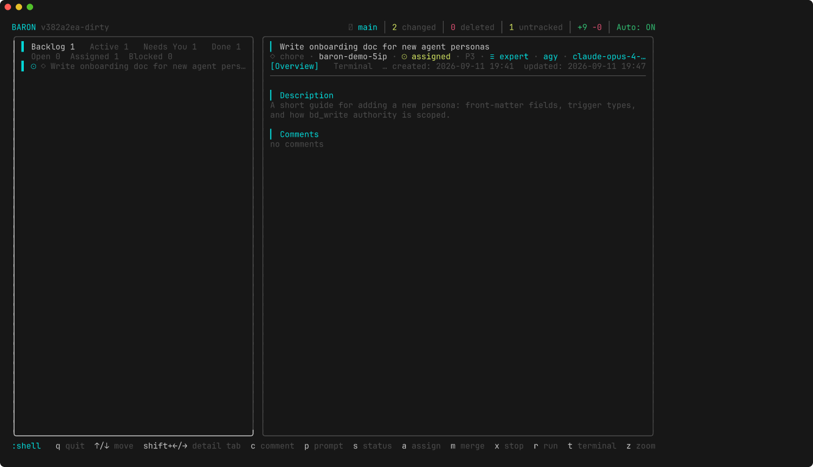
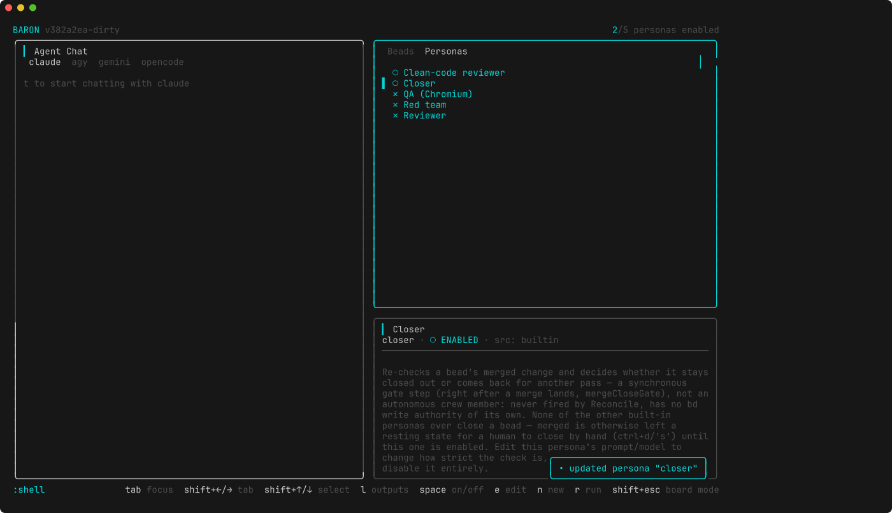
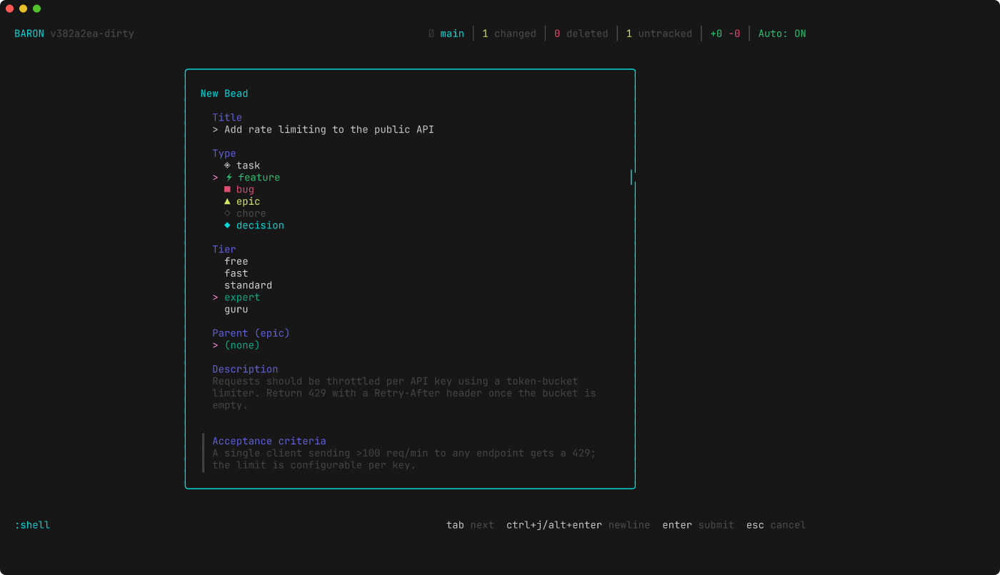
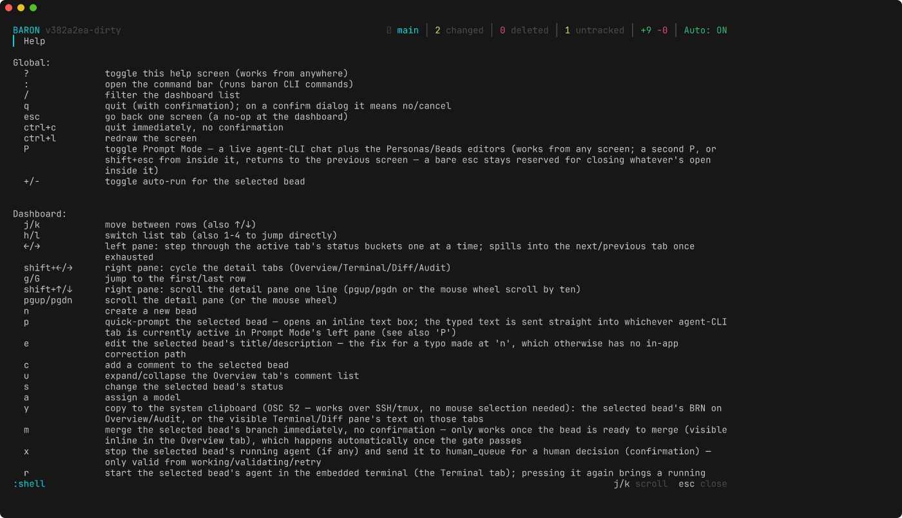

<div align="center">
  <h1>🏰 BARON</h1>
  <p><strong>Local-first AI coding agent orchestrator.</strong></p>

  
  
  
  
</div>

BARON turns your backlog into a fleet of AI coding agents. You describe the
work as **beads** — small, well-scoped tasks — and BARON dispatches each one
to a coding agent CLI (Claude Code, Codex, opencode, Gemini, agy, Cline, …)
running in its own isolated git worktree and tmux window. Nothing lands on
your base branch until it clears your project's own build/lint/test
pipeline, passes a secret scan, and — if you enable it — a reviewer persona
signs off. Everything happens on your machine, in your terminal, against
your own git history: there's no server, no cloud dashboard, no daemon.

> *BARON doesn't write code itself. It's the manager: it hands out the work,
> watches the agents, enforces your gate, and decides what's safe to merge.*

---

## Dashboard

<table>
  <tr>
    <td width="50%">
      
      <br /><strong>Board Mode</strong><br />
      Every bead's state at a glance — Backlog, Active, Needs You, Done —
      with a live overview/terminal/diff/audit pane for whatever's selected.
    </td>
    <td width="50%">
      
      <br /><strong>Prompt Mode (Crew)</strong><br />
      A live agent-CLI chat next to your persona roster — background
      reviewers you can enable, edit, or fire on demand.
    </td>
  </tr>
  <tr>
    <td width="50%">
      
      <br /><strong>New Bead</strong><br />
      Title, type, capability tier, parent epic, description, and
      acceptance criteria — everything an agent needs to start, in one form.
    </td>
    <td width="50%">
      
      <br /><strong>Full keymap, always one keystroke away</strong><br />
      Press <code>?</code> from anywhere for the generated help screen —
      it's built from the same table that drives every keybinding.
    </td>
  </tr>
</table>

---

## Why BARON

* 🧵 **Isolated by construction.** Every bead gets its own git worktree and
  its own tmux window, so agents never collide on the same working tree —
  and a bead's agent keeps running whether or not BARON itself is open.
* 🎯 **Tier-first assignment, not vendor lock-in.** You assign a bead a
  capability tier — `free`, `fast`, `standard`, `expert`, `guru` — and BARON
  resolves it to whatever real model is actually installed and healthy on
  this machine right now. Swap `claude` for `opencode` without touching a
  single bead.
* 🚦 **A real quality gate, not a vibe check.** Before a bead can merge it
  runs your project's own build/lint/test pipeline. Go, React/TypeScript,
  Rust, PHP, and Python profiles ship built-in and auto-detected; anything
  else is a `[profiles.<name>]` TOML block away — no Go code required.
* 🔒 **Gitleaks on every diff.** Secret scanning runs as part of the gate;
  a real finding blocks the merge outright, no override.
* 🤝 **Merge policy you actually control.** Require a human on every merge
  (the default), or opt into auto-merge scoped by tags, max changed files,
  max diff lines, and forbidden paths.
* 👥 **Crew Mode: a background team, not just a worker pool.** Personas are
  scheduled or event-triggered prompts that manage bead state on their own
  — a reviewer that gates `mergable`, a closer that double-checks a merge
  before it's really done, a red-team sweep for CVEs every morning, a QA
  persona that drives a live Chromium session after merge.
* 💀 **Silent-death detection.** An agent that goes quiet mid-run doesn't
  sit there lying about its status — BARON notices and routes it to retry.
* 📝 **Everything is audited.** Every state transition, assignment, and
  merge is appended to a durable audit log with the actor who did it —
  human, manager (the reconciler), or persona.
* 🖥️ **Genuinely local-first.** One binary, a TOML config in `.baron/`,
  a `bd` issues database in `.beads/`. No account, no telemetry, no cloud
  copy of your code ever leaves the tools you already run locally.

---

## The bead lifecycle

A bead moves through one state machine from creation to merge. Only BARON
itself — never the agent — is allowed to move a bead into `merged`; that
boundary is structural, not a convention:

```text
open ──▶ assigned ──▶ working ──▶ validating ──▶ mergable ──▶ merged
```

`working → validating` is your project's gate pipeline running for real
(build, lint, test — whatever the bead's profile defines). An epic never
runs its own agent pipeline at all — it jumps straight from `open` to
`mergable` the moment every child bead has merged.

The happy path is the easy part; what makes it safe to leave unattended is
what happens off that path:

* **Gate failure → `retry`.** `working` or `validating` can bounce to
  `retry` up to `gate.retry_budget` times, each attempt relaunching the
  agent, before escalating to a human in `human_queue`.
* **Unmet dependency → `blocked`.** A bead with a live `blocks` dependency
  is held in `blocked` and returns to `open` on its own the moment that
  dependency clears — no one has to remember to unblock it.
* **`human_queue` is a real decision point.** From there a human can
  reassign it (`assigned`), send it back to work (`working`), or close it
  out — the state exists precisely so a stuck or failed bead surfaces
  instead of spinning silently.
* **`merged` isn't always final.** The optional Closer persona (or a human)
  can reopen a merge that doesn't actually hold, landing it back on `open`
  for a fresh attempt.
* **`cancelled` is reachable from anywhere non-terminal** — the one
  universal escape hatch.

---

## Supported agent CLIs

BARON probes your machine on startup and only offers what's actually
installed and healthy — no config needed for the common case.

| Agent | CLI | Notes |
|---|---|---|
| Claude Code | `claude` | Model shortcuts (`haiku`/`sonnet`/`opus`/`fable`) plus `--effort` reasoning levels |
| Codex | `codex` | |
| opencode | `opencode` | Live model catalog and per-model `--variant` (reasoning) discovery |
| Gemini | `gemini` | |
| agy | `agy` | |
| Cline | `cline` | |
| *anything else* | — | Register a project-local `[[agents]]` block in `config.toml` — no code required |

---

## Installation

BARON is Go, and it drives a handful of small CLIs it doesn't bundle.

**Required**

* [Go](https://go.dev) 1.25+ (to build)
* `git` 2.30+
* `bd` — the beads issue tracker BARON stores work items in (`brew install beads`)

**Recommended**

* [`gitleaks`](https://github.com/gitleaks/gitleaks) — secret scanning on every gate run
* [`tmux`](https://github.com/tmux/tmux) — persistent agent sessions that outlive BARON itself
* [Hunk](https://github.com/hunk-review/hunk) — the diff reviewer embedded in BARON's Diff tab; review comments left there round-trip back to the agent as steering

```bash
git clone https://github.com/ykocaman/baron.git
cd baron
brew bundle --file scripts/brew/Brewfile.recommended   # gitleaks, tmux
make build                                              # -> bin/baron
```

A Homebrew formula ships in-tree at [`scripts/brew/baron.rb`](scripts/brew/baron.rb)
for when the tap goes live.

---

## Quickstart

```bash
cd your-project     # any git repository
/path/to/bin/baron
```

There is no subcommand and no flag to learn — `baron` takes no arguments.
The first run walks you through a one-time setup: it detects your git repo,
writes `.baron/config.toml` with a language profile it auto-detected, asks
once whether to enable auto-merge, and runs `bd init` for you. Every run
after that opens straight into the dashboard.

From there:

| Key | Does |
|---|---|
| `n` | Create a new bead (title, type, tier, description, acceptance criteria) |
| `a` | Assign a model/tier — this is what puts an agent to work |
| `r` | Start the bead's agent in the embedded terminal |
| `s` | Change a bead's status by hand |
| `m` | Merge a bead once it's `mergable` |
| `P` | Enter Prompt Mode — chat with any agent CLI directly, manage your persona crew |
| `:` | Open the command bar |
| `?` | Full generated help screen, from anywhere |
| `q` | Quit |

---

## Configuration

Everything lives in `.baron/config.toml`, written once on first run and
safe to hand-edit afterward:

```toml
[general]
  profile = "go"          # auto-detected: go, react-ts, rust, php, python
  auto_start = true        # reconciler starts an assigned bead's agent on its own
                            # (off = it just flags the bead as needing a start)
  base_branch = "main"     # beads branch from here; merge keeps it current

[gate]
  timeout = 10             # minutes per gate run
  retry_budget = 3         # failed gate runs before a bead escalates to a human
  [gate.gitleaks]
    enabled = true

[merge]
  require_human = true     # the safe default
  [merge.auto]
    enabled = false         # opt in during init, or flip this later
    require_tags = []
    max_changed_files = 0   # 0 = unlimited
    max_diff_lines = 0
    forbid_paths = []

[tui]
  theme = "dark"
  tmux = "auto"             # auto | always | never
```

Gate pipelines for languages BARON doesn't ship a profile for are just
another TOML block — a `[profiles.<name>]` section with `formatter`,
`linter`, `test`, `build` commands, or a fully custom `[[profiles.<name>.steps]]`
pipeline. Personas (the Crew Mode roster) are plain Markdown files with a
YAML front matter, one per file, under `~/.config/baron/personas/` —
editable from inside Prompt Mode (`e`) or by hand.

---

## Crew Mode: the persona roster

Beyond the agents that do the coding, BARON ships five built-in personas —
disabled by default, toggle any of them on with `space` in Prompt Mode:

| Persona | Fires on | Does |
|---|---|---|
| **Reviewer** | Before `mergable` | Reviews the diff against the bead's own description and acceptance criteria — a real gate, not a nitpick pass |
| **Closer** | Right after a merge | Re-checks the merged change and decides whether it stays closed or comes back for another pass |
| **Clean-code reviewer** | On merge/close | Flags code that reimplements something a library already does |
| **QA (Chromium)** | On merge | Verifies the change end-to-end in a live browser |
| **Red team** | Daily, `0 9 * * *` | Sweeps dependencies for known CVEs and comments on affected beads |

Every persona is scoped: none of them can merge a bead — that authority
stays with a human (or a pre-approved auto-merge policy) exclusively.

---

## Architecture

```text
┌─────────────────────────────── your terminal ───────────────────────────────┐
│                                                                              │
│   Board Mode ◀──────── P ────────▶ Prompt Mode (Crew)                       │
│   dashboard / diff / audit          agent chat + persona & bead editors     │
│                                                                              │
└───────────────────────────────────┬─────────────────────────────────────────┘
                                     │
                      ┌──────────────┴──────────────┐
                      │      Reconciler (manager)     │  auto-assigns, retries,
                      └──────────────┬──────────────┘  fixes stale state labels
                                     │
        ┌────────────────┬──────────┴──────────┬───────────────────┐
        ▼                ▼                     ▼                   ▼
   bd (.beads/)     agent registry        gate runner          merge policy
   issue store      claude/codex/…        build·lint·test      + gitleaks scan
        │            probed live               │                   │
        ▼                ▼                     ▼                   ▼
   git worktree ──▶ tmux window ──▶ agent CLI process ──▶ hunk (diff review)
   per bead          per bead        headless invocation    round-tripped as
                                                             bead comments
```

* **Language:** Go, single static binary, no external runtime.
* **State:** a TOML config per project (`.baron/`), a machine-wide agent
  cache (`~/.cache/baron`), machine-wide personas (`~/.config/baron`).
* **UI:** [Bubble Tea](https://github.com/charmbracelet/bubbletea) /
  [Lip Gloss](https://github.com/charmbracelet/lipgloss) — no web server,
  no browser, ever.
* **Issue store:** `bd` — BARON is the orchestration layer on top of it,
  not a replacement for it.

---

## Development

```bash
make build       # bin/baron
make test-unit   # go test -race -count=1 (excludes e2e)
make test-e2e    # real tmux sessions, ptys, git/bd subprocesses
make lint        # golangci-lint
make fmt         # gofumpt
make fix         # modernize + gofumpt + golangci-lint --fix
make cross       # linux/amd64, darwin/arm64, darwin/amd64, windows/amd64
```

---

## License

MIT.
